# IncidentLens

**Can a small fine-tuned language model reliably analyze production-style incidents from backend logs?**

[🌐 Project Portfolio](https://sivasanker.vercel.app/projects/incident-lens)

IncidentLens is an end-to-end incident analysis platform that turns backend log streams into structured incident assessments. Instead of treating every warning or error as an isolated event, it groups related log sequences into incidents and uses a fine-tuned small language model to assess severity, determine the appropriate operational response, identify a likely root cause, and recommend next steps.

The project combines **log analysis, parameter-efficient fine-tuning, on-demand GPU training, model artifact management, and observability** into a single system.

Success was measured on two dimensions: **decision quality** — choosing the right severity and response — and **explanation quality** — ensuring claims are actually supported by the logs. The second turned out to be the harder problem and became the central finding of the project.

## Application

<p align="center">
  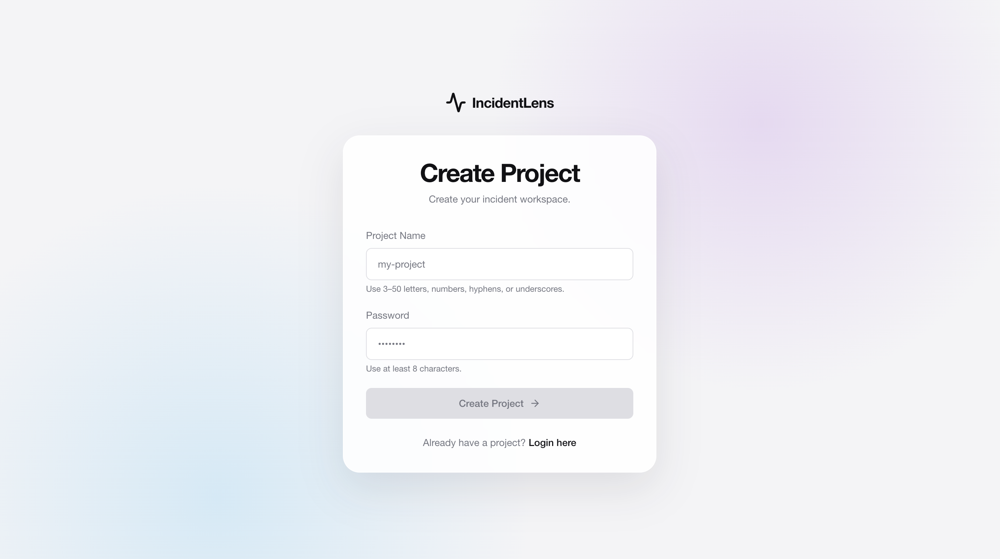
</p>

IncidentLens provides a single interface for configuring log analysis, managing
training datasets, launching fine-tuning jobs, and working with trained model
artifacts.

<table>
  <tr>
    <td align="center">
      
    </td>
    <td align="center">
      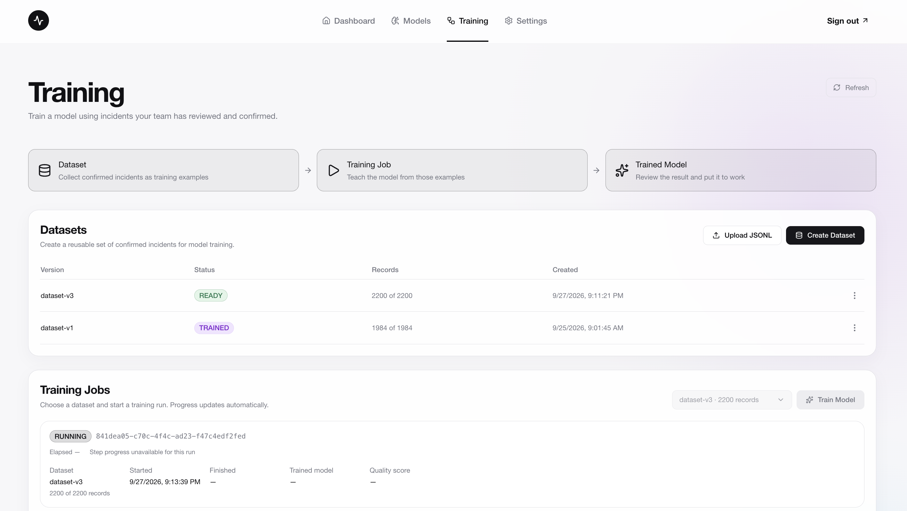
    </td>
  </tr>
  <tr>
    <td align="center">
      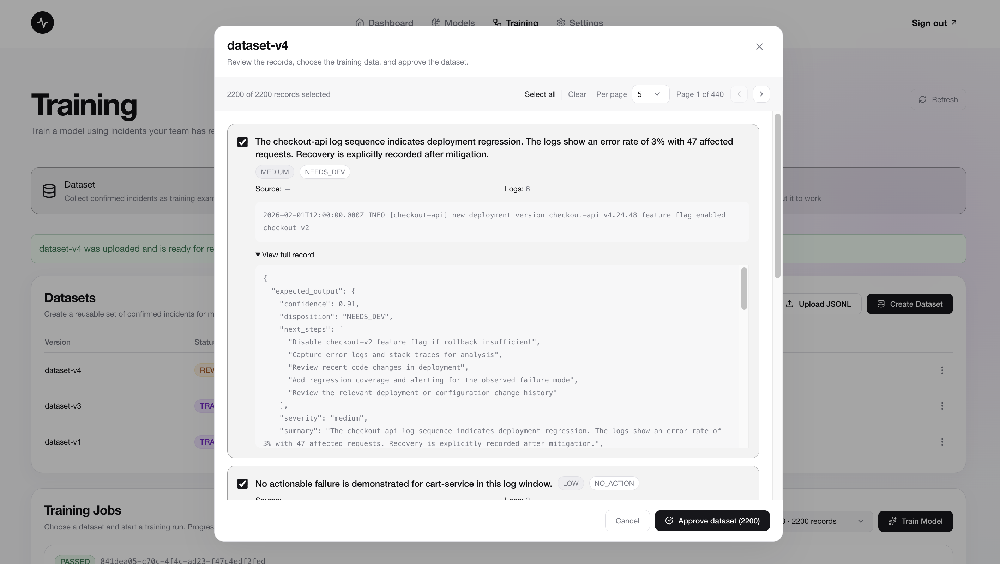
    </td>
    <td align="center">
      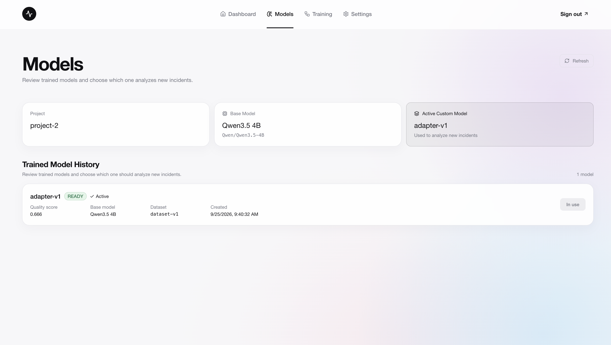
    </td>
  </tr>
  <tr>
    <td align="center" colspan="2">
      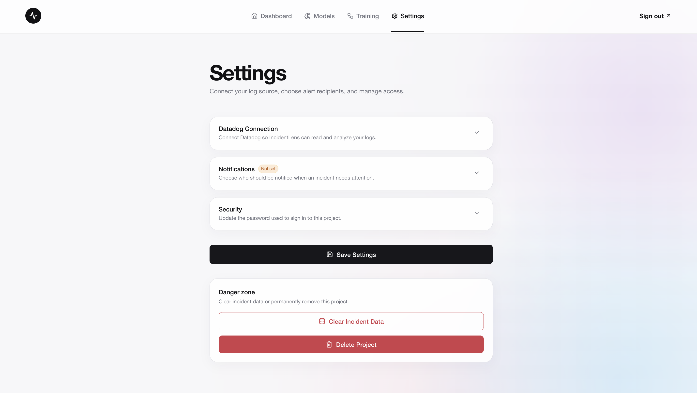
    </td>
  </tr>
</table>

## Technical Stack

| Layer            | Technology                                       |
| ---------------- | ------------------------------------------------ |
| Frontend         | React                                            |
| Backend          | FastAPI, Python                                  |
| Base Model       | Qwen/Qwen3.5-4B                                  |
| Fine-Tuning      | QLoRA / LoRA                                     |
| ML Framework     | PyTorch                                          |
| Model Tooling    | Hugging Face Transformers, PEFT                  |
| Database         | Neon PostgreSQL                                  |
| Artifact Storage | Amazon S3                                        |
| Training Compute | Amazon EC2 GPU instances                         |
| Observability    | Datadog                                          |
| Containerization | Docker                                           |
| CI/CD            | GitHub Actions                                   |
| Model Output     | Structured JSON                                  |
| Evaluation       | 29 unseen incident scenarios (2,000+ log events) |

---

## The Problem

A production incident rarely appears as one clean error.

It is usually a sequence:

```text
warning
   |
   v
repeated warning
   |
   v
degraded capacity
   |
   v
failure
   |
   v
mitigation / recovery
```

Finding the `ERROR` line is easy. Answering the questions that actually matter is harder:

- Is this a real incident?
- How severe was the impact?
- What operational response is appropriate?
- What likely caused it?
- What evidence supports that conclusion?
- What should an engineer investigate next?

IncidentLens was built around that problem.

---

## Application Flow

A user creates a project and connects a log source. IncidentLens continuously works with incoming backend logs, groups related events into incident context, and passes the relevant evidence to the project's model for analysis.

The application also supports project-specific model training. Instead of maintaining an expensive GPU instance continuously, training compute is provisioned only when a user requests a fine-tuning job.

```text
                         IncidentLens
                              |
          +-------------------+-------------------+
          |                   |                   |
          v                   v                   v
     Backend Logs       Application State     Model Training
          |                   |                   |
          v                   v                   v
     Log Analysis       Neon PostgreSQL       Training Job
          |             - Projects                |
          |             - Incidents               v
          |             - Training Jobs     On-Demand GPU EC2
          |             - Model Metadata          |
          |                                       v
          |                                QLoRA Fine-Tuning
          |                                       |
          |                              +--------+--------+
          |                              |                 |
          |                              v                 v
          |                         Amazon S3          Datadog
          |                       Model Artifacts    Training Logs
          |                              |
          +------------------------------+
                         |
                         v
                 Incident Analysis
```

**Neon PostgreSQL** stores persistent application state such as projects, incidents, training jobs, and model metadata. **Amazon S3** stores larger ML artifacts including training inputs, configuration, and LoRA adapters.

---

## Incident Analysis

IncidentLens analyzes related events as a sequence rather than independently classifying individual log lines.

For example:

```text
Kafka consumer lag increases
            |
            v
lag continues rising
            |
            v
consumer rebalance
            |
            v
processing failures
            |
            v
scaling / recovery
            |
            v
      Incident Context
            |
            v
   Fine-Tuned Qwen3.5-4B
            |
            v
   Structured Assessment
```

This context allows the model to reason about persistence, escalation, impact, and recovery rather than reacting to the severity label attached to a single log message.

The model produces:

- severity
- operational disposition
- confidence
- summary
- suspected root cause
- next steps
- ticket title
- ticket body

---

## Model Output

Every assessment follows a fixed JSON contract:

```json
{
  "severity": "high",
  "disposition": "NEEDS_ONCALL",
  "confidence": 0.91,
  "summary": "Consumer lag increased and was accompanied by repeated consumer rebalances.",
  "suspected_root_cause": "Consumer instability reduced processing capacity and caused backlog growth.",
  "next_steps": [
    "Inspect consumer health and rebalance frequency.",
    "Verify partition assignment and downstream processing latency."
  ],
  "ticket_title": "Investigate sustained Kafka consumer lag",
  "ticket_body": "Review consumer stability, partition assignment, and downstream processing behavior."
}
```

Severity represents **how serious the observed impact was**, while disposition represents **what operational response is required**.

---

## On-Demand Fine-Tuning

Model training is designed as an ephemeral workload.

When a training job is requested, IncidentLens dynamically launches a GPU-backed EC2 instance from a prepared training image. The instance retrieves its training inputs, performs QLoRA fine-tuning, stores the resulting adapter, updates the model metadata, and terminates when the job finishes.

```text
User Starts Training
        |
        v
Training Job Created
        |
        v
Dataset + Config
        |
        v
     Amazon S3
        |
        v
Launch GPU EC2
        |
        v
Download Training Inputs
        |
        v
QLoRA Fine-Tuning
        |
        +----------------------+
        |                      |
        v                      v
 Training Progress          Datadog
        |
        v
LoRA Adapter
        |
        v
    Amazon S3
        |
        v
Model Artifact Registered
        |
        v
Training Job Completed
        |
        v
Terminate GPU Instance
```

### Ephemeral GPU Training

##### GPU Instances

<p align="center">
  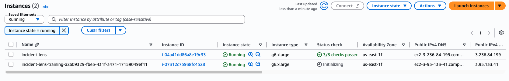
</p>

##### Training AMI

<p align="center">
  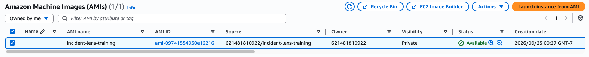
</p>

This keeps GPU compute **on demand**: the expensive training instance exists only while a model is being fine-tuned.

Training progress is observable through Datadog, including model/system information, progress percentage, loss, validation, artifact creation, completion, and failure information.

---

## Model Artifact Lifecycle

Fine-tuning does not create another complete copy of the 4B base model for every experiment.

QLoRA produces a project-specific LoRA adapter:

```text
Qwen3.5-4B
    +
Training Dataset
    |
    v
QLoRA Fine-Tuning
    |
    v
LoRA Adapter
    |
    v
Amazon S3
    |
    +--> Versioned Artifact
    |
    +--> Metadata in Neon
    |
    v
Incident Analysis
```

This separates the reusable base model from the learned project-specific parameters and makes individual training runs independently versionable.

### Artifact & Model State

<p align="center">
  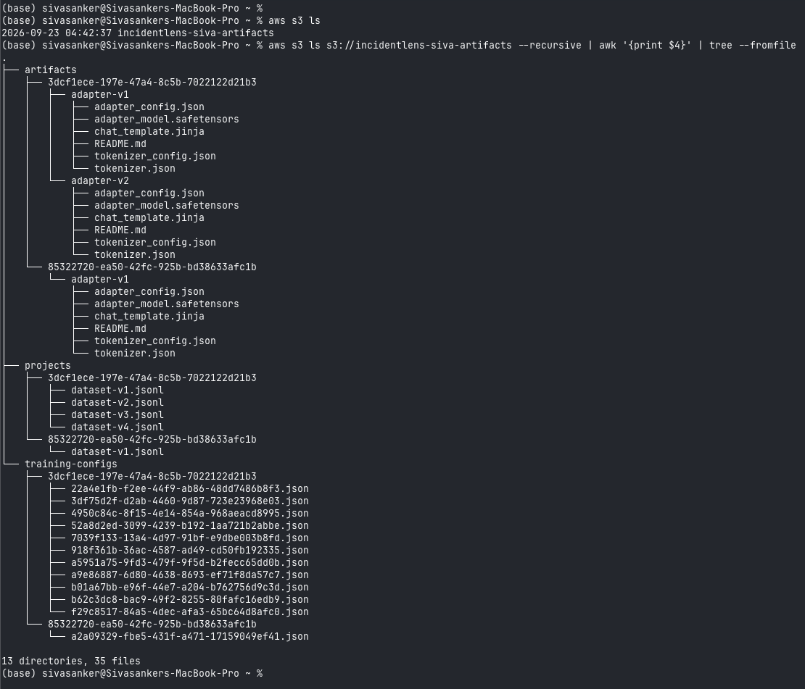
  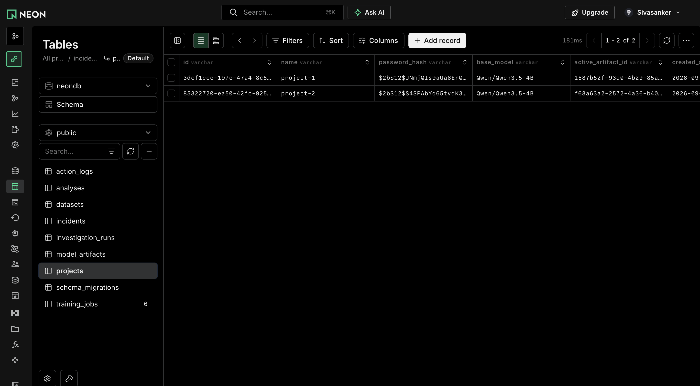
</p>

---

## Deployment

IncidentLens is deployed as separate frontend, backend, data, model-storage, and training layers.

```text
                    GitHub
                       |
                       v
                 GitHub Actions
                       |
              +--------+--------+
              |                 |
              v                 v
           Frontend          Backend
            React            FastAPI
              |                 |
              +--------+--------+
                       |
             +---------+----------+
             |                    |
             v                    v
      Neon PostgreSQL        Amazon S3
      Application State      ML Artifacts
                                  |
                                  v
                         On-Demand GPU EC2
                                  |
                                  v
                           QLoRA Training

                    Datadog
                       ^
                       |
             Logs + Training Telemetry
```

The backend is containerized with **Docker**, while **GitHub Actions** provides the automated build/deployment workflow.

Persistent application state and large ML artifacts are deliberately separated: PostgreSQL handles relational application data, while S3 handles datasets, configuration objects, and model adapters.

GPU training is also isolated from the main application so model fine-tuning does not consume resources from the incident-analysis service.

<p align="center">
  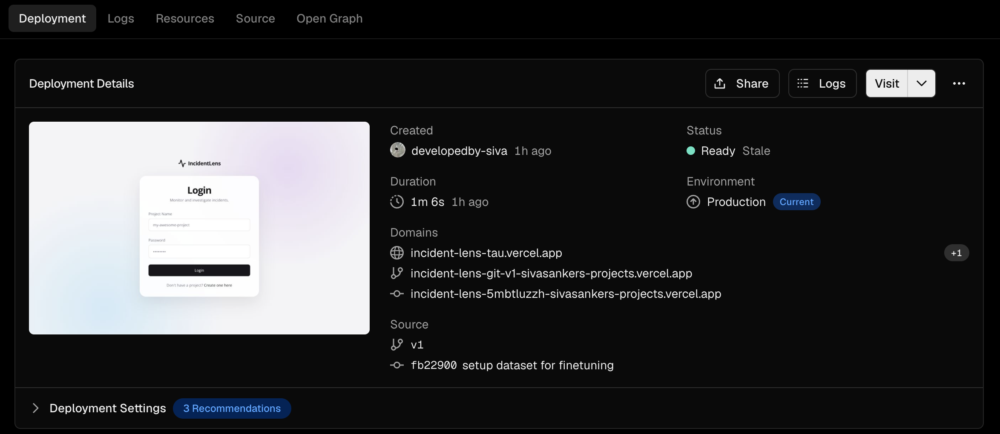
</p>

---

## Fine-Tuning & Dataset

The final experiment fine-tunes **Qwen/Qwen3.5-4B** using QLoRA/LoRA on approximately **2,200 incident-analysis examples**.

| Parameter               |            Value |
| ----------------------- | ---------------: |
| LoRA rank               |                8 |
| LoRA alpha              |               16 |
| Dropout                 |             0.05 |
| Target modules          |       all-linear |
| Learning rate           |             1e-4 |
| Epochs                  |                1 |
| Batch size              |                1 |
| Gradient accumulation   |                1 |
| Maximum sequence length |             1024 |
| Validation split        |              10% |
| Split strategy          | Group-stratified |
| Seed                    |               42 |

Each training example contains a sequence of related backend logs paired with the expected structured assessment.

The loss is applied to the assistant response rather than the input prompt, focusing training on generation of the expected incident assessment.

### Dataset Evolution

The dataset went through several redesigns as weaknesses became visible during experimentation.

| Problem                       | Change                                        | Why it mattered                                            |
| ----------------------------- | --------------------------------------------- | ---------------------------------------------------------- |
| Dataset leakage               | Grouped related scenarios during validation   | Prevented near-identical scenarios appearing on both sides |
| Label imbalance               | Diversified severity/disposition combinations | Reduced simple label shortcuts                             |
| Recovery bias                 | Used maximum observed impact                  | Prevented recovery from artificially lowering severity     |
| Severity/disposition coupling | Modeled them separately                       | Allowed different responses for similar impact             |
| Template repetition           | Increased scenario diversity                  | Reduced memorization                                       |
| Chronological inconsistency   | Enforced ordered log sequences                | Preserved incident progression                             |
| Limited context               | Increased multi-event sequences               | Better represented real incidents                          |
| Structured output             | Fixed JSON training contract                  | Improved output reliability                                |

---

## Validation Strategy

A naive random split initially allowed variations of the same synthetic scenario to appear in both training and validation.

For example:

```text
TRAIN
Kafka lag -> rebalance -> processing failure -> recovery

VALIDATION
Kafka lag -> rebalance -> processing failure -> recovery
```

Changing timestamps or identifiers does not make these genuinely independent scenarios.

The final training process therefore uses **group-stratified validation**:

```text
2,200 Examples
      |
      v
Scenario Groups
      |
      v
Group-Stratified Split
     / \
    /   \
   v     v
Train   Validation
```

The final split achieved **zero overlapping scenario groups** between training and validation.

---

## Evaluation

Evaluation was kept completely separate from training.

The final benchmark contains **29 manually curated unseen incident scenarios** with known incident boundaries, severity, disposition, and relevant evidence.

The scenarios cover a broad range of backend failures, including:

- Kafka consumer lag
- expired TLS certificates
- memory pressure and OOM
- database connectivity failures
- Redis memory exhaustion
- deployment failures
- queue backlogs
- Kafka broker failures
- database connection-pool exhaustion
- configuration failures
- Elasticsearch failures
- pod crash loops
- disk pressure
- vendor API timeouts
- thread-pool exhaustion
- database deadlocks
- payment degradation
- DNS resolution failures

Three dimensions were evaluated separately:

**Classification** — Did the model choose the correct severity and disposition?

**Structured output** — Did it consistently produce the required machine-readable schema?

**Grounding** — Were the claims in the explanation actually supported by the supplied logs?

---

## Results

The final classification-focused experiment achieved:

| Metric                         |    Result |
| ------------------------------ | --------: |
| Severity accuracy              | **82.8%** |
| Supported-class severity F1    | **0.778** |
| Disposition accuracy           | **89.7%** |
| Supported-class disposition F1 | **0.914** |
| Critical recall                |  **100%** |
| ESCALATE recall                |  **100%** |
| JSON validity                  |  **100%** |

The model learned the decision-making portion of the task particularly well: all critical incidents and all `ESCALATE` cases in the evaluation set were identified.

---

## Classification vs. Grounding

The experiments exposed an important distinction.

```text
                  Incident Logs
                       |
                       v
                 Fine-Tuned Model
                    /       \
                   /         \
                  v           v
           Classification   Explanation
              |     |        |    |
              v     v        v    v
          Severity Action   RCA  Next Steps
```

The final experiment performed strongly on the **classification side**, but explanation grounding remained harder.

Even when severity and disposition were correct, generated explanations could introduce details not established by the evidence, including:

- request counts
- error percentages
- customer-impact claims
- failover actions
- paging activity
- mitigation or recovery details

For example:

```text
Observed:
Kafka consumer lag increased significantly.

Supported:
high / NEEDS_ONCALL

Unsupported:
"1,000 customers were affected."
```

The model may know that this type of incident often causes customer impact, but that does not mean the supplied logs establish that it happened in this particular incident.

Later experiments tightened evidence-grounding constraints. Grounding improved, but classification performance decreased.

```text
Classification-Focused Run
        |
        +--> Strong classification
        |
        +--> Weaker grounding


Grounding-Focused Runs
        |
        +--> Better evidence discipline
        |
        +--> Lower classification performance
```

The classification-focused experiment was therefore retained as the final model result, while grounded explanation remained the primary limitation.

> **Correct classification does not automatically mean grounded generation.**

---

## Observability

Datadog provides visibility into both sides of the system.

Application logs provide the raw operational signals used by IncidentLens, while temporary training instances emit training telemetry.

A training run exposes a lifecycle similar to:

```text
Training Started
       |
       v
Model / GPU / Memory
       |
       v
Dataset Loaded
       |
       v
Training Progress
       |
       +--> Percentage
       +--> Step
       +--> Loss
       +--> Elapsed Time
       |
       v
Validation
       |
       v
Artifact Upload
       |
       v
Model Registered
       |
       v
Instance Cleanup
```

This makes fine-tuning observable without requiring direct access to the temporary GPU instance.

### Live Training Telemetry

Training progress from temporary GPU instances is streamed into Datadog, making
the full training lifecycle observable without SSH access to the instance.

<p align="center">
  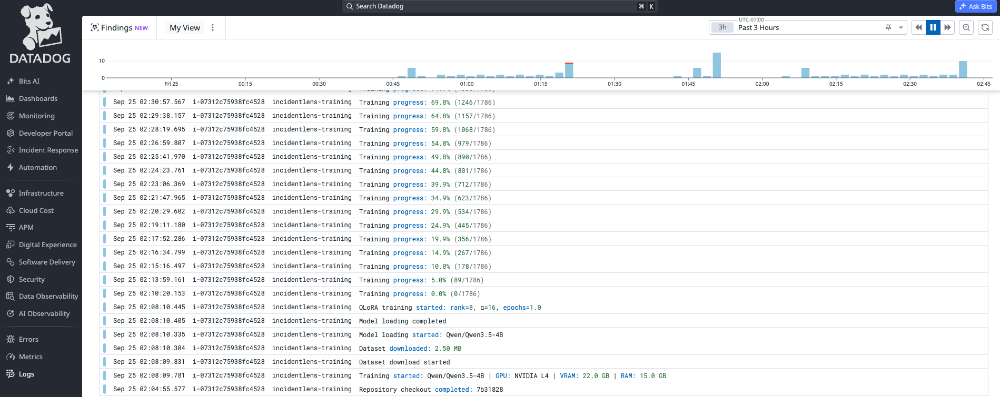
</p>

<p align="center">
  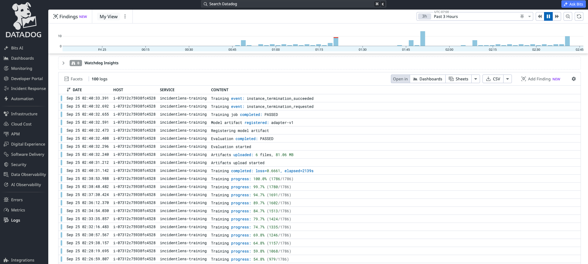
</p>

---

## What I Learned

1. **Validation loss alone can be misleading.** With synthetic or template-heavy data, the split strategy matters as much as the metric.

2. **Dataset design mattered more than hyperparameter tuning.** Improving scenario structure and label relationships had greater impact than repeatedly adjusting LoRA parameters.

3. **Severity and disposition are separate decisions.** Severity describes impact; disposition describes the required operational response.

4. **Recovery does not erase impact.** A recovered incident may still have experienced serious production impact earlier in the sequence.

5. **Sequence context matters.** Escalation, persistence, mitigation, and recovery provide information that an isolated error line cannot.

6. **Structured generation can be trained reliably.** The final experiment achieved 100% valid JSON.

7. **Classification and grounding are different problems.** A model can correctly decide what happened operationally while still making unsupported claims when explaining why.

---

## Limitations and Future Work

The primary remaining limitation is **evidence-grounded explanation generation**.

The current model demonstrates strong incident classification, but explanatory text can still go beyond what the supplied logs establish.

Promising future directions include:

- explicit evidence extraction before explanation generation
- span-level grounding between claims and log lines
- citation-backed incident explanations
- evidence-constrained decoding
- separating classification from explanation generation
- more diverse incident sequences
- dedicated factual-consistency evaluation

---

## Final Takeaway

IncidentLens started as a question about whether a small fine-tuned model could understand production incidents, but the project ultimately exposed a more interesting problem.

The final model achieved:

```text
Severity Accuracy       82.8%
Disposition Accuracy    89.7%
Critical Recall        100.0%
ESCALATE Recall        100.0%
Valid JSON             100.0%
```

But strong classification did not automatically produce fully trustworthy explanations.

That became the central lesson of the project:

> **Getting the incident decision right is only part of getting the incident analysis right.**
